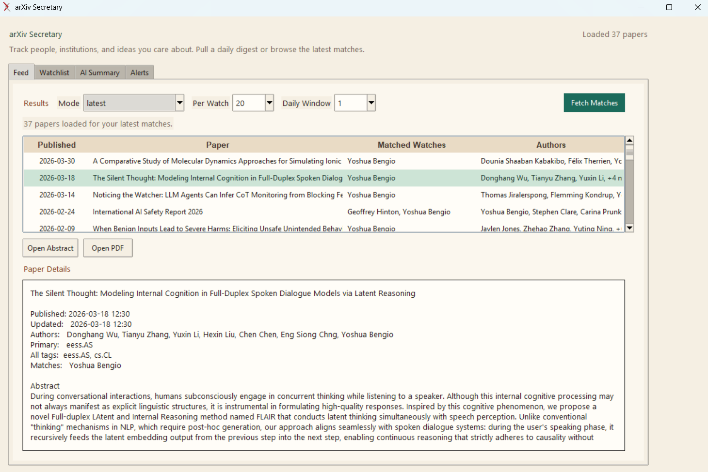
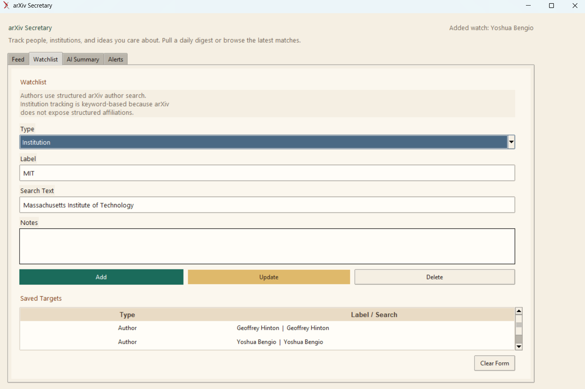

<div align="center">

# ArXiv Secretary

A lightweight desktop GUI for tracking arXiv authors, institution keywords, and research topics.

</div>

arXiv Secretary helps researchers stay on top of the papers that matter to them without living in a browser tab. Build a personal watchlist, review a latest or daily feed, generate AI summaries of new papers, and configure alerts for recurring updates.

---
<p align="center">
  
  
</p>

## Highlights

- Track arXiv authors, topics, and institution keywords
- Review papers in `Latest` and `Daily` feed modes
- Open abstracts and PDFs directly from the app
- Generate AI summaries with OpenAI or Anthropic
- Configure desktop and email alerts
- Schedule update checks daily, weekly, or monthly


## Features

- Personal watchlists for authors, research topics, and institution-based keyword tracking
- Feed view that de-duplicates matches across multiple watch targets
- Paper details panel for abstracts, authors, categories, and quick actions
- AI Summary tab for turning fresh papers into a concise research brief
- Alerts tab for recurring update checks and optional SMTP email delivery
- Windows desktop distribution with packaged builds and installer support

## Installation

### Windows executable

Download the latest packaged build from the [GitHub Releases](https://github.com/itsalissonsilva/ArxivSecretary/releases) page.

### From source

```powershell
python main.py
```

## AI and Alerts

ArxivSecretary supports:

- OpenAI and Anthropic for AI-generated summaries
- Desktop alert pop-ups
- SMTP-based email notifications

AI summaries require your own provider API key. Email alerts require your own SMTP configuration.

## Notes

- Institution tracking is implemented as keyword matching because arXiv does not expose structured affiliation data in its public API.
- Scheduled alerts run while the app is open.
- arXiv is a trademark of Cornell University and is referenced here only to describe compatibility with the arXiv service.

## Roadmap

- Improved installer and distribution flow
- Better onboarding for first-time watchlist setup
- Polished release process for Windows builds
